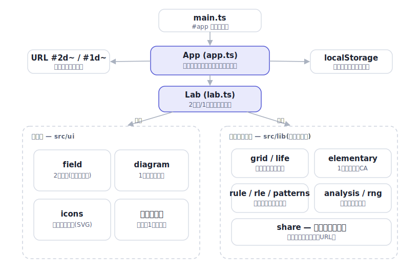

# cellab

[](https://github.com/miruky/cellab/actions/workflows/ci.yml)
[](https://github.com/miruky/cellab/actions/workflows/deploy.yml)
[](https://www.typescriptlang.org/)
[](LICENSE)

**セルオートマトンの実験場。2次元のライフ系ルールと1次元の基本CAを切り替え、盤に描き込み、種を撒き、世代を進めて観察する**

デモ: https://miruky.github.io/cellab/

## 概要

cellabはセルオートマトンをブラウザ内で動かして観察するための場である。2つのモードを持つ。2次元モードはコンウェイのライフゲームに代表される「B/S記法」のルール(近傍が何個で誕生し、何個で生存するか)を扱い、盤をマウスでなぞって生きたセルを描いたり、グライダーやパルサーといった既知のパターンを置いたりして、再生すると世代が進んでいく。1次元モードはWolframのルール0〜255の基本セルオートマトンで、1本の行が世代ごとに下へ積み上がり、ルール30のカオスやルール90のシェルピンスキー三角形のような時空模様が育つ。

盤の境界はトーラス(上下左右がつながった輪環)と有限盤を切り替えられ、ルールはプリセットから選ぶほかB/S記法を直接入力できる。今の盤が静物・振動子(周期つき)・消滅のどれに落ち着くかを調べる解析、状態をそのままURLに載せる共有、盤面をRLE形式で書き出す機能を備える。配色はライトとダークに対応し、再生速度・グリッド線の有無は記憶される。動かさずに1世代ずつ進めることも、キーボードだけで操作することもできる。

描画から切り離した中核ロジック(盤面・近傍計算・世代規則・基本CA・パターン・RLE入出力・周期判定)は `src/lib` にまとまっており、DOMを一切参照しない。古典パターンが既知の周期や速度で振る舞うことや、ダイハードがちょうど130世代で消えることまで、テストで実際に検証している。

### なぜ作ったのか

ライフゲームの実装は世に多いが、その大半はコンウェイのB3/S23固定で、盤を眺めるだけのものだった。ルールを変えたり、1次元の基本CAと並べて見たり、「このパターンは結局どうなるのか」を言葉で返してくれたりするものが欲しかった。とくにB/S記法を任意に変えると景色が一変するのに、それを手軽に試せる場所が少ない。あわせて、CAのロジックは描画と混ざりやすく再利用しにくいので、盤面と規則と解析を純粋な関数群として切り出し、画面はその上に薄く載せる形にした。古典パターンの振る舞いをテストで縛っておけば、ルールや最適化に手を入れても壊れていないことがすぐ分かる。

## アーキテクチャ



`src/lib` はDOMに触れない純粋なロジックで、盤面の表現・近傍と世代の規則・1次元基本CA・ルール記法とRLE・既定パターン・周期判定・状態の符号化がここで完結する。`src/lab.ts` がこれらを束ねた状態機械で、2次元と1次元のどちらのモードでも世代を進め・描き込み・解析を提供する。`src/ui` の描画層と `src/app.ts` がその上に画面を載せ、URLとlocalStorageへの出入りを受け持つ。数千セルが毎フレーム更新される盤と時空図はキャンバスへ直接描き、ロゴ・アイコン・図解はSVGで用意している。

## 技術スタック

| カテゴリ             | 技術                                  |
| :------------------- | :------------------------------------ |
| 言語                 | TypeScript 5(strict、実行時依存ゼロ)  |
| 描画                 | Canvas 2D(盤・時空図)/ SVG(装飾)     |
| ビルド               | Vite 6                                |
| テスト               | Vitest(node + happy-dom)              |
| リンタ・フォーマッタ | ESLint(typescript-eslint)+ Prettier   |
| CI / 配信            | GitHub Actions / GitHub Pages         |

## 使い方

### 触る

上部のセグメントで「ライフ系」(2次元)と「基本CA」(1次元)を切り替える。再生・一時停止、1世代だけ進める、消去、ランダム配置、速度の調整は中央のトランスポートにまとまっている。主なキーボード操作は次のとおり。

- Space 再生 / 一時停止
- `.` または右矢印 1世代進める
- `c` 消去、`r` ランダムに撒き直す
- `g` グリッド線の表示切り替え
- `m` モード切り替え

2次元モードでは盤をなぞって生きたセルを描き、ツールを「置く」にすると選んだパターン(グライダー、パルサー、ゴスパーの銃など)を盤に置ける。ルールはプリセットの選択か、B/S記法(例 `B3/S23`)の直接入力で変えられる。「判定」を押すと今の盤が静物・振動子・消滅のどれに向かうかを調べる。「共有」で状態を載せたリンクをコピーし、「RLE」で盤面をRLE形式で書き出す。

### ライブラリとして使う

中核ロジックは `src/lib` から型付きで使える。盤面の表現と世代規則は次のように扱う。

```ts
import { Grid, parseRule, step } from './src/lib';

const grid = Grid.fromStrings(['.O.', '..O', 'OOO']); // グライダー
const conway = parseRule('B3/S23');
const next = step(grid, conway, 'torus'); // 1世代進めた新しい盤
next.population(); // 生きているセルの数
```

`step` は元の盤を変えず、新しい盤を返す。境界は `'torus'`(輪環)か `'bounded'`(有限)を選ぶ。

### パターンとRLE

LifeWikiなどで配布されるRLE形式をそのまま読み込み、書き出せる。

```ts
import { parseRle, toRle, PATTERNS, patternGrid } from './src/lib';

const glider = patternGrid(PATTERNS.find((p) => p.id === 'glider')!);
const text = toRle(glider, { name: 'glider', rule: 'B3/S23' });

const parsed = parseRle('x = 3, y = 3\nbo$2bo$3o!');
parsed.grid.population(); // 5
```

### 1次元の基本CA

```ts
import { centeredRow, elementaryHistory } from './src/lib';

const rows = elementaryHistory(centeredRow(64), 90, 32, true);
// rows[0] が種、以降が各世代。ルール90は左右対称の三角模様になる。
```

### 状態の解析と共有

```ts
import { Grid, parseRule, classify, encodeState, decodeState } from './src/lib';

const blinker = Grid.fromStrings(['OOO']);
classify(blinker, parseRule('B3/S23'), 'torus'); // { kind: 'oscillator', period: 2 }

const hash = encodeState({ mode: '2d', rule: 'B3/S23', topology: 'torus', grid: blinker });
decodeState(hash); // 同じ状態が復元される
```

## プロジェクト構成

- `src/lib/grid.ts` 2次元盤の表現(Uint8Array)、範囲外の安全な扱い、スタンプ、ハッシュ
- `src/lib/life.ts` ムーア近傍の計数と、B/Sルールによる世代の更新
- `src/lib/rule.ts` B/S記法の解釈と正規化、代表的なルールのプリセット
- `src/lib/elementary.ts` 1次元の基本CA(ルール0〜255)と履歴の生成
- `src/lib/rle.ts` RLE形式の読み書き
- `src/lib/patterns.ts` 静物・振動子・宇宙船・銃・長寿型の古典パターン
- `src/lib/analysis.ts` 盤が静物・振動子・消滅のどれに落ち着くかの判定
- `src/lib/share.ts` 状態の連長符号(URL共有の本体)
- `src/lib/rng.ts` シード付き擬似乱数(再現可能なランダム配置)
- `src/lab.ts` 2次元/1次元をまとめる状態機械
- `src/ui/field.ts` 2次元盤のキャンバス描画とポインタ操作
- `src/ui/diagram.ts` 1次元の時空図の描画
- `src/ui/icons.ts` 操作アイコン(currentColorのSVG)
- `src/app.ts` 画面の統括(トランスポート・パネル・キーボード・テーマ・共有・保存)
- `src/share.ts` 状態とURLハッシュの相互変換
- `src/storage.ts` 表示の好みのlocalStorage保存
- `docs/` アーキテクチャ図

## はじめ方

### 前提条件

- Node.js 22以上

### セットアップ

```bash
git clone https://github.com/miruky/cellab.git
cd cellab
npm ci
npm run dev
```

### テスト・lint・ビルド

```bash
npm test
npm run lint
npm run build
```

テストは、盤面モデルの不変条件、近傍計算と世代更新の正しさ、古典パターンが既知の周期・速度・寿命で振る舞うこと(点滅器やパルサーの周期、グライダーやLWSSの移動、ゴスパー銃の無限成長、ダイハードの130世代での消滅)、RLEの往復、1次元基本CAの対称性、状態機械の操作と共有の往復、そしてキャンバスのポインタ操作が正しいセルに対応することを検査する。

### デプロイ

mainへのpushで `deploy.yml` がGitHub Pagesへ公開する。サブパス配信のためのbaseは環境変数 `CELLAB_BASE` で渡す。

## 制約

- 解析は30世代まで調べて静物・振動子・消滅を判定する。それより長い周期や、無限に成長・移動し続けるパターンは「定まらず」として扱う。
- ルールは2状態(生/死)のトーテリスティック(近傍の合計だけで決まる)に限る。複数状態や近傍の並びに依存する規則は対象外。
- 共有リンクには2次元なら盤面そのものを連長符号で載せる。盤が大きく密だとリンクは長くなる。1次元はルールと種だけを載せ、行幅は開いた環境の設定に従う。
- 1次元の時空図は表示できる世代数に上限があり、超えた分は上から流れて消える。種からの全体を見たいときは初期化して見直す。
- 表示の好みは端末のlocalStorageに保存する。別の端末やブラウザへは引き継がれない。

## 設計方針

- **ロジックと描画を分ける** — `src/lib` はDOMを一切参照せず、盤面・規則・基本CA・パターン・解析だけで完結する。おかげで古典パターンの振る舞いをnode環境のテストで直接縛れて、画面はその純粋な核に薄く載るだけで済む。
- **盤はビット詰めのまま素早く回す** — セルは0/1を詰めたUint8Arrayで持ち、近傍計算はトーラスと有限で別関数に分け、行のオフセットを使い回して無駄な分岐と境界判定を避ける。数千セルを毎フレーム更新しても滑らかに動く。
- **重い描画はキャンバス、装飾はSVG** — 毎フレーム塗り替わる盤と時空図はキャンバスへ直接描き、ロゴ・アイコン・図解のようにスケールと再利用が要るものはSVGにする。道具を用途で使い分けることで、規模が増えても描画が破綻しない。
- **既知の振る舞いをテストで固定する** — グライダーが4世代で1マス斜めに進む、ダイハードが130世代で消える、といった事実をテストに落とす。最適化やルール追加で中身を変えても、壊れていないことがすぐ分かる。
- **状態は素直にURLへ** — 盤面・ルール・種を可逆に符号化してフラグメントに載せる。サーバーを持たずに「この実験を見て」と渡せて、テストも決定的に書ける。

## ライセンス

[MIT](LICENSE)
